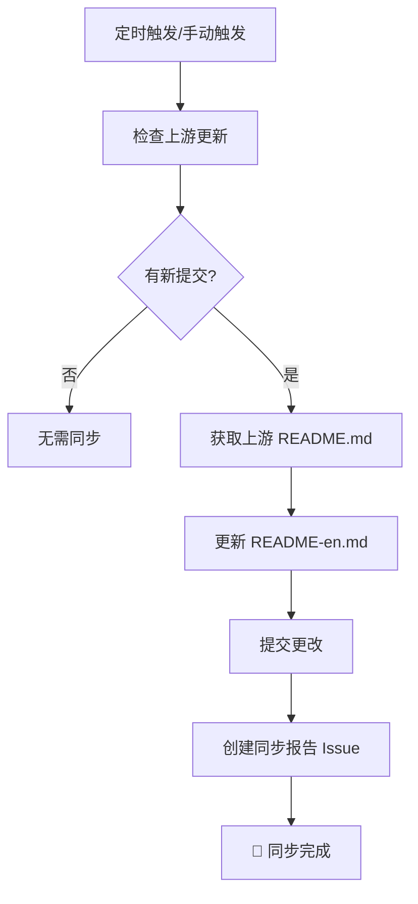

# 🔄 上游仓库同步指南

本文档说明如何保持您的中文翻译项目与原始英文项目 [hesreallyhim/awesome-claude-code](https://github.com/hesreallyhim/awesome-claude-code) 同步。

## 🎯 同步策略

我们采用**英文版本自动同步，中文版本手动翻译**的策略：

- ✅ **自动同步**: 英文版本 (`README-en.md`) 自动与上游保持同步
- 📝 **手动翻译**: 中文版本 (`README.md`, `README-zh-TW.md`) 需要手动更新翻译
- 🔒 **保护中文**: 自动同步不会覆盖中文翻译内容

## 🤖 自动同步 (推荐)

### GitHub Actions 自动同步

我们配置了 GitHub Actions 工作流，会自动检查上游更新：

- **运行时间**: 每天北京时间早上 8 点
- **检查频率**: 每日自动检查
- **同步内容**: 仅同步英文版本到 `README-en.md`
- **通知方式**: 创建 Issue 报告同步状态

#### 手动触发自动同步

1. 访问您的 GitHub 仓库
2. 点击 **Actions** 选项卡
3. 选择 **🔄 同步上游仓库更新** 工作流
4. 点击 **Run workflow** 按钮
5. 选择是否强制同步，然后点击 **Run workflow**

### 自动同步流程



## 🛠️ 手动同步

### 使用同步脚本 (推荐)

我们提供了一个便捷的同步脚本：

```bash
# 基本同步
./scripts/sync-upstream.sh

# 强制同步（忽略是否有更新）
./scripts/sync-upstream.sh --force
```

#### 脚本功能特性

- ✅ **安全检查**: 检查未提交更改，避免丢失本地修改
- 🔍 **智能对比**: 自动检测上游是否有新提交
- 💾 **自动备份**: 同步前自动备份当前版本
- 📊 **详细报告**: 显示同步摘要和上游更改
- 🎨 **彩色输出**: 清晰的状态提示和进度显示

### 手动 Git 命令同步

如果您更喜欢使用原生 Git 命令：

```bash
# 1. 确保工作区干净
git status

# 2. 获取上游更新
git fetch upstream

# 3. 检查是否有新提交
git log --oneline HEAD..upstream/main

# 4. 同步英文版本
git show upstream/main:README.md > README-en.md

# 5. 提交更改
git add README-en.md
git commit -m "🔄 同步上游更新"
git push origin main
```

## 📝 翻译更新工作流

当上游有重大更新时，您需要手动更新中文翻译：

### 1. 检查更新内容

```bash
# 查看英文版本的变更
git diff HEAD~1 README-en.md

# 或者使用 GitHub 网页界面对比
# https://github.com/xianyu110/awesome-claude-code-zh/compare/
```

### 2. 更新中文翻译

根据英文版本的变更，更新对应的中文文件：

- **简体中文**: `README.md`
- **繁体中文**: `README-zh-TW.md`
- **术语对照**: `docs/i18n/terminology.md`

### 3. 翻译质量检查

使用我们的翻译指南确保质量：

- ✅ 参考 [术语对照表](i18n/terminology.md)
- ✅ 保持技术术语的准确性
- ✅ 确保格式与原版一致
- ✅ 验证所有链接有效

### 4. 提交翻译更新

```bash
git add README.md README-zh-TW.md docs/i18n/terminology.md
git commit -m "📝 更新中文翻译

- 新增: [具体新增内容]
- 修改: [具体修改内容]
- 优化: [优化说明]

基于上游提交: [上游提交哈希]"
git push origin main
```

## 🔧 配置说明

### 远程仓库配置

您的项目应该有两个远程仓库：

```bash
# 查看当前配置
git remote -v

# 应该显示：
# origin    https://github.com/xianyu110/awesome-claude-code-zh (fetch)
# origin    https://github.com/xianyu110/awesome-claude-code-zh (push)
# upstream  https://github.com/hesreallyhim/awesome-claude-code.git (fetch)
# upstream  https://github.com/hesreallyhim/awesome-claude-code.git (push)
```

如果没有 upstream，手动添加：

```bash
git remote add upstream https://github.com/hesreallyhim/awesome-claude-code.git
```

### GitHub Actions 权限

确保 GitHub Actions 有足够权限：

1. 访问仓库 **Settings** > **Actions** > **General**
2. 在 **Workflow permissions** 部分选择 **Read and write permissions**
3. 勾选 **Allow GitHub Actions to create and approve pull requests**

## 📊 同步状态监控

### Issue 报告

每次自动同步后，系统会创建一个 Issue 报告：

- 📅 **同步时间**: 显示同步执行时间
- 📋 **更改摘要**: 列出上游最新提交
- ✅ **同步状态**: 确认哪些文件已更新
- 📝 **后续行动**: 提醒需要手动翻译的内容

### 标签系统

我们使用标签来管理同步相关的 Issue：

- 🔄 **自动同步**: 自动同步创建的 Issue
- 📝 **需要翻译**: 需要更新中文翻译的提醒
- 🚀 **已完成**: 翻译更新已完成

## ❗ 注意事项

### 冲突处理

如果遇到合并冲突：

1. **不要强制覆盖中文版本**
2. 仅解决英文版本 (`README-en.md`) 的冲突
3. 保持中文版本不变
4. 手动检查并更新中文翻译

### 文件保护

- ✅ **安全文件**: `README.md`, `README-zh-TW.md`, `docs/i18n/` - 不会被自动同步覆盖
- ⚠️  **同步文件**: `README-en.md` - 会被自动同步覆盖
- 📝 **手动维护**: 所有中文内容需要手动维护

### 最佳实践

1. **定期检查**: 每周检查一次同步状态
2. **及时翻译**: 发现重大更新时及时更新中文翻译
3. **保持一致**: 确保三个语言版本的结构保持一致
4. **测试链接**: 定期检查链接的有效性

## 🆘 故障排除

### 常见问题

#### 1. 同步脚本权限错误

```bash
chmod +x scripts/sync-upstream.sh
```

#### 2. Git 远程仓库配置错误

```bash
git remote remove upstream
git remote add upstream https://github.com/hesreallyhim/awesome-claude-code.git
```

#### 3. GitHub Actions 权限不足

检查仓库设置中的 Actions 权限配置。

#### 4. 合并冲突

```bash
# 重置到干净状态
git reset --hard HEAD
git clean -fd

# 重新执行同步
./scripts/sync-upstream.sh --force
```

### 获取帮助

如果遇到问题：

1. 查看 [GitHub Actions 日志](https://github.com/xianyu110/awesome-claude-code-zh/actions)
2. 检查最近的同步报告 Issue
3. 提交新的 Issue 描述问题
4. 参考 [贡献指南](../CONTRIBUTING.md)

---

## 📈 同步统计

通过这个同步系统，您可以：

- 🤖 **自动化**: 减少 90% 的手动同步工作
- ⏱️ **及时性**: 24小时内获得上游更新
- 🛡️ **安全性**: 保护中文翻译不被覆盖
- 📊 **可视化**: 清晰的同步状态报告
- 🔄 **可靠性**: 多种同步方式确保稳定性

通过自动同步英文版本 + 手动翻译中文版本的策略，既保证了与上游项目的同步，又维护了高质量的中文翻译内容。 